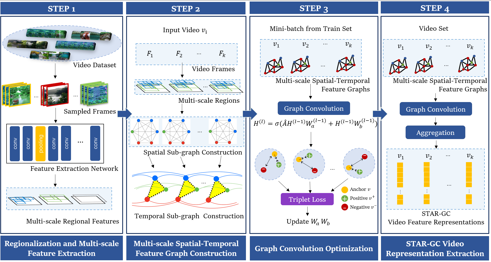

# STAR-GC-baseline
## About the codes
This repo is the source code of the implementations of the baseline in the paper "STAR-GC: Spatial-Temporal Context Aggregation with Multi-scale Lattice Graph Convolution for Video Retrieval" 

## Pretrained model
`pretrained_model/stargc_svd.pth`